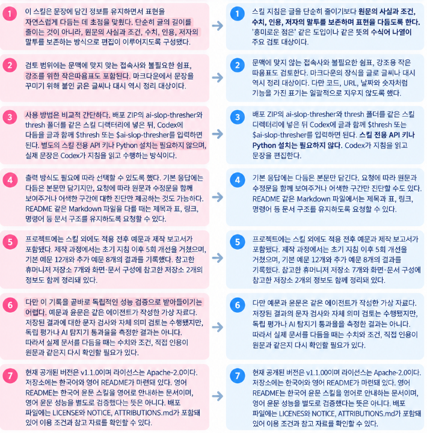

<p align="center">
  
</p>

<h1 align="center">AI Slop Thresher:<br>This Text Is Not Interesting.</h1>

<p align="center">
  An agent skill that cuts stock phrases, repeated praise, and needless explanation from Korean drafts.<br>
  It edits sentences while preserving the original facts and voice.
</p>

<p align="center">
  <a href="https://github.com/Burntgogi/ai-slop-thresher/releases/tag/v1.2.4"></a>
  <a href="https://github.com/Burntgogi/ai-slop-thresher/releases/tag/v1.2.4"></a>
  <a href="#editing-rules"></a>
  <a href="#validation-scope"></a>
  <a href="LICENSE"></a>
</p>

<p align="center">
  <a href="README.md">한국어</a> · <strong>English</strong> ·
  <a href="#before-and-after">Before &amp; after</a> · <a href="#install">Install</a> ·
  <a href="#usage">Usage</a> · <a href="#license">License</a>
</p>

The skill's instructions and evaluation examples are in Korean. This page explains how to use it on Korean text.

v1.2.4 keeps the v1.2.2 editing instructions and tidies distribution, so Codex and Claude Code share one plugin folder and one install name. It removes empty praise, shortens wording while preserving conditions and per-person limits, changes information grouping or placement only when the context warrants it, and keeps the shape of preserved quotation marks and symbols.

The Korean [release notes](docs/releases/v1.2.4.md) and [execution comparison](evaluation/regression-20261007/README.md) record the verification scope. Running the released v1.2.0 and v1.2.1 in Codex showed no loss of meaning; these results do not establish superiority on every text. Previous-version users can consult the [version selection guide](docs/version-choice.md).

In Codex, paste your draft with a request such as the following. Use your harness's invocation syntax elsewhere:

```text
$thresh Edit the Korean text below for natural phrasing. Preserve its meaning and tone.
```

## Before and after

The image below presents selected passages from the Korean article introducing the skill, edited with the v1.1.0 instructions.

<p align="center">Left, pink: before · Right, blue: after · Korean text</p>

<p align="center">
  <a href="assets/ai-slop-thresher-comparison-ko.png"></a>
</p>

Items 5 and 7 retain their content. Select the image to view it at its original size. The [full article and editing record](reports/article-demo/README.md) include the reasons for each edit in Korean.

<details>
<summary>Read a short product notice example in English</summary>

These are English translations of a synthetic Korean product notice used during development. The skill was applied to the Korean original.

### Before

> The interesting thing is that the new dashboard supports fast, swift, and agile work. In internal tests, weekly report writing time fell from 30 minutes to 10 minutes. However, reports can also be downloaded as 'CSV'. The fun part is that report writing time has been reduced in this way. This change sets **a new standard for work**.

### After

> In internal tests of the new dashboard, weekly report writing time fell from 30 minutes to 10 minutes. Reports can also be downloaded as CSV.

The edit removes repeated praise and a misplaced contrast. It keeps the scope of the internal tests, both time values, and the CSV feature. The [20 full examples](reports/comparisons.md) include cases with conditions, quotations, and code.

</details>

<details>
<summary>Original Korean example</summary>

Before:

> 흥미로운 점은 새 대시보드가 빠르고, 신속하며, 민첩한 업무 처리를 지원한다는 점입니다. 내부 테스트에서 주간 보고서 작성 시간은 30분에서 10분으로 줄었습니다. 하지만, 보고서는 'CSV'로도 내려받을 수 있습니다. 재미있는 점은 이처럼 보고서 작성 시간을 줄였다는 것입니다. **업무의 새로운 기준**을 제시하는 변화입니다.

After:

> 새 대시보드의 내부 테스트에서 주간 보고서 작성 시간이 30분에서 10분으로 줄었습니다. 보고서는 CSV로도 내려받을 수 있습니다.

</details>

## Install

Shared instructions live in `skills/`, and harness-specific settings live in `integrations/`. Both are combined into one plugin, `plugins/ai-slop-thresher/`, used by Codex and Claude Code alike. Portable skills contain no harness-specific settings.

```text
skills/                            # Shared canonical skills
integrations/codex/                # Codex manifest and metadata
integrations/claude-code/          # Claude Code manifest and frontmatter
plugins/ai-slop-thresher/          # Generated plugin shared by both hosts
.agents/plugins/marketplace.json   # Codex catalog
.claude-plugin/marketplace.json    # Claude Code catalog
```

Manual installation needs no Python: place both portable skill folders together in a supported skills directory. See the [harness installation guide](docs/installation.md) for Codex plugins, Claude Code, OpenCode, Cursor, and generic destinations. The installation script needs Python 3.10+ and previews changes by default:

```powershell
python scripts/distribute.py install --target codex
python scripts/distribute.py install --target claude-code
python scripts/distribute.py install --target opencode
python scripts/distribute.py install --target cursor
```

After reviewing the destination, add `--apply` to the selected command to install. Existing skill directories are never overwritten. In Codex, choose either plugin installation or direct skill installation.

Claude Code can also install the skills as a plugin. Add the repository with `/plugin marketplace add Burntgogi/ai-slop-thresher`, run `/plugin install ai-slop-thresher@ai-slop-thresher`, and invoke `/ai-slop-thresher:thresh`. For the short `/thresh`, use the `--target claude-code` direct installation instead. In the Codex CLI, run `codex plugin marketplace add Burntgogi/ai-slop-thresher --ref v1.2.4`, then `codex plugin add ai-slop-thresher@ai-slop-thresher`. If you installed from the `ai-slop-thresher-local` catalog of v1.2.3 or earlier, move to the new name as described in the [installation guide](docs/installation.md#codex-플러그인). On Windows, if you see `Filename too long`, run `git config --global core.longpaths true`. Gemini CLI, GitHub Copilot, Amp, Goose, and Windsurf read the same `~/.agents/skills` directory as Codex.

## Usage

`$thresh` and `$ai-slop-thresher` apply the same editing instructions. The `thresh` shortcut reads the main skill, so install both folders together.

| Task | Example request |
| --- | --- |
| Return the edited text | `$thresh Edit the Korean text below. Keep its polite tone.` |
| Compare versions | `$thresh Show the original and edited Korean text, then briefly explain the changes.` |
| Diagnose only | `$thresh Identify awkward passages in this Korean text and explain why. Leave the text unchanged.` |
| Edit a Markdown file | `$thresh Edit the Korean prose in README.md. Preserve headings, tables, links, and commands.` |

By default, the skill returns only the edited text. It does not append a work summary, an offer of further help, or the product tagline.

## Editing rules

| What it removes | What it preserves |
| --- | --- |
| Stock openings such as “the interesting thing” and repeated praise | Distinct claims and the author's feelings |
| Misplaced connectors and strings of similar modifiers | Actual causes, contrasts, and sequences of events |
| Unnecessary commas, emphasis quotes, and decorative formatting | Direct quotations, code, URLs, dates, and numerical notation |
| Explanations and endings that repeat an earlier point | Conditions, evidence, steps, and examples the reader needs |
| Repeated negation that restates the same point | Corrections, responsibility, harm, actual distinctions, risk, and uncertainty |

The instructions forbid turning possibilities into facts or inventing personal experiences. Sentences that already read naturally stay as they are. See [SKILL.md](skills/ai-slop-thresher/SKILL.md) for the full rules in Korean.

## Validation scope

During v1.0.0 development, the initial instructions went through five improvement rounds. The project records original and edited text for 12 core examples and eight additional examples. Checks cover required text and protected values in saved outputs, alongside a review of meaning by the same agent.

The originals and edits are synthetic examples written by the same agent. They have not undergone independent evaluation, and no AI detector pass rate was measured. The `checks` badge refers to checks on the saved examples. For real documents, compare numbers, conditions, and quotations with the original.

The [development improvement report](reports/improvement-20260930.md) records fresh agent outputs, five further improvement rounds, and the scope of Codex, Dot, and Muse reviews. The separate Codex evaluator uses the same model family; this is not independent human evaluation or evidence of cross-model generalization.

The [release-based A/B comparison](reports/ab-comparison-20260930.md) found equal meaning-preservation judgments. Style preferences favored v1.1.0 in 10 pairs, v1.2.0 in 5, and tied in 40; one pair was ineligible. This exploratory comparison used 28 synthetic cases twice per version and does not establish overall quality superiority for v1.2.0.

## References

The projects below informed the editing criteria and documentation layout. The skill instructions and Korean examples are original work.

| Project | What informed this project |
| --- | --- |
| [blader/humanizer](https://github.com/blader/humanizer) | Reviewing repetitive openings, endings, and paragraph structures |
| [op7418/Humanizer-zh](https://github.com/op7418/Humanizer-zh) | Adapting translation and formatting checks to the target language |
| [hardikpandya/stop-slop](https://github.com/hardikpandya/stop-slop) | Removing previews of the main point, empty conclusions, and decorative dashes |
| [conorbronsdon/avoid-ai-writing](https://github.com/conorbronsdon/avoid-ai-writing) | Avoiding invented facts and separating diagnosis from editing |
| [epoko77-ai/im-not-ai](https://github.com/epoko77-ai/im-not-ai) | Korean particles and connective endings, register, and quotation preservation |
| [AIScientists-Dev/academic-humanizer](https://github.com/AIScientists-Dev/academic-humanizer) | Preserving conditions, sample scope, and qualifications in academic writing |
| [Nanako0129/sepia](https://github.com/Nanako0129/sepia) | Making minimal edits for the genre and audience while retaining the author's voice |
| [Burntgogi/Gpt_Codex_HWP](https://github.com/Burntgogi/Gpt_Codex_HWP) | Placement of the banner, title, navigation, examples, and installation steps |
| [Burntgogi/codex_oracle](https://github.com/Burntgogi/codex_oracle) | Centered introduction, badge colors and placement, language links, and release documentation |

[ATTRIBUTIONS.md](ATTRIBUTIONS.md) records the revisions reviewed, links to their license files, and the scope of each reference. Thanks to the maintainers and contributors who made this work available.

The header badges use [Shields.io](https://shields.io/badges/static-badge). The [layout notes](docs/github-frontpage.md) explain their sources and labels.

## License

This project is licensed under Apache-2.0. See [LICENSE](LICENSE) for the terms and [NOTICE](NOTICE) and [ATTRIBUTIONS.md](ATTRIBUTIONS.md) for copyright and reference information. Referenced projects retain their own copyrights and licenses.

## Documentation

The detailed documentation below is in Korean.

[Release notes](RELEASE_NOTES.md) · [Changelog](CHANGELOG.md) · [Development report](reports/ai-slop-thresher-report.md) · [20 original and edited examples](reports/comparisons.md) · [Verification guide](docs/verification.md)

[Layout and design sources](docs/github-frontpage.md) · [README and release notes editing record](reports/document-editing.md) · [Full project ZIP](https://github.com/Burntgogi/ai-slop-thresher/releases/download/v1.2.4/ai-slop-thresher-workbench.zip)
